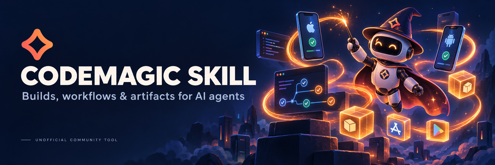

# Codemagic Skill

[](https://github.com/HelgeSverre/codemagic-skill/actions/workflows/ci.yml)
[](https://www.python.org/)
[](https://docs.astral.sh/uv/)
[](https://docs.astral.sh/ruff/)
[](#install-the-plugin)
[](LICENSE)

Give Claude Code and Codex the tools to operate your Codemagic builds. Find an
app, select a workflow, start a build from a branch or tag, inspect the result,
and locate its artifacts—all through the official Codemagic REST API.

One shared skill works in both clients. Its bundled Python CLI has **zero runtime
dependencies** and also runs on its own. No MCP server or background service is
required.

> “Show the latest failed build for my app and which steps failed.”
>
> “Build the staging workflow from `feature/login`.”
>
> “Find the APK and IPA artifacts from that build.”

## Install the plugin

Requires Python 3.11+ and a current Claude Code or Codex client with plugin support.
The plugin includes the CLI; agents can run the bundled script directly.

### Claude Code

```sh
claude plugin marketplace add HelgeSverre/codemagic-skill
claude plugin install codemagic@codemagic-tools
```

Start a new session and use `/codemagic:codemagic`, or ask a Codemagic question.
For a local checkout, try `claude --plugin-dir /path/to/codemagic-skill`.

### Codex

```sh
codex plugin marketplace add HelgeSverre/codemagic-skill
codex plugin add codemagic@codemagic-tools
```

Start a new session and select the `codemagic` skill from the plugin. You can
also ask directly: “Use the Codemagic skill to list my apps.”

### Install only the skill

Copy the self-contained `skills/codemagic` folder into your client's user skill
directory. This works without plugin support:

```sh
git clone https://github.com/HelgeSverre/codemagic-skill.git
mkdir -p ~/.agents/skills ~/.claude/skills
cp -R codemagic-skill/skills/codemagic ~/.agents/skills/codemagic
cp -R codemagic-skill/skills/codemagic ~/.claude/skills/codemagic
```

Use either the plugin or the standalone skill in each client to avoid duplicate
entries. Codex also supports `~/.codex/skills` in installations that use that
location. For development, symlink the skill directory to keep the checkout
canonical; see [Contributing](CONTRIBUTING.md).

## Authentication

Create a personal API token in Codemagic under **Teams → Personal Account →
Integrations → Codemagic API → Show**. Some UI versions call this **Account
settings → API token**. The token has your account's team permissions.

Expose it as `CODEMAGIC_API_KEY` in the environment that launches your agent or
terminal. `CODEMAGIC_API_TOKEN` and `CM_API_TOKEN` are also supported, in that
order after `CODEMAGIC_API_KEY`.

For a local terminal login, install the CLI below and run:

```sh
codemagic-api auth login
codemagic-api auth status
```

The hidden prompt verifies the token before saving it. On macOS/Linux, the
fallback token file is `~/.config/codemagic-api/token` (or under
`$XDG_CONFIG_HOME`), with permissions `0600`. It is plaintext. Windows uses an
environment variable instead of token-file login. No token belongs in this repo,
plugin manifests, prompts, or shell command arguments.

## Standalone CLI

Install from Git with [uv](https://docs.astral.sh/uv/):

```sh
uv tool install git+https://github.com/HelgeSverre/codemagic-skill.git
codemagic-api --help
```

Or run from a checkout without installing anything:

```sh
python3 skills/codemagic/scripts/codemagic_api.py --help
```

| Task | Command |
| --- | --- |
| List teams | `codemagic-api teams` |
| Find team apps | `codemagic-api apps --team TEAM_ID --name my-app` |
| List workflows | `codemagic-api workflows APP_ID` |
| Recent builds | `codemagic-api builds --team TEAM_ID --app APP_ID` |
| Build details | `codemagic-api build BUILD_ID` |
| Step statuses | `codemagic-api actions BUILD_ID` |
| Artifact URLs | `codemagic-api artifacts BUILD_ID` |
| Cancel a build | `codemagic-api cancel BUILD_ID` |

Start a build with the **workflow ID**, which may differ from its display name:

```sh
codemagic-api start --app APP_ID --workflow WORKFLOW_ID \
  --branch feature/login --dry-run

# Submit the same request after reviewing the preview.
codemagic-api start --app APP_ID --workflow WORKFLOW_ID \
  --branch feature/login
```

Use exactly one of `--branch` or `--tag`. `--inputs-file` and
`--environment-file` accept JSON objects for workflow inputs and environment
overrides. List commands return pagination metadata; use `--page` or `--cursor`
to fetch subsequent results. Output is JSON, with diagnostics on stderr.

For other documented JSON endpoints:

```sh
codemagic-api api GET '/teams/TEAM_ID/variable-groups'
codemagic-api api POST '/apps/APP_ID/builds' --data-file request.json --dry-run
```

Read the [API notes](skills/codemagic/references/api.md) for payload formats,
version differences, and endpoint mappings.

## Behavior to know

- A selected workflow can publish to stores or testers. Starting that workflow
  runs its configured publishing steps too.
- A build request accepted with HTTP 202 is queued, not completed. Its ID may
  briefly return 404 while Codemagic creates the build.
- Requests are never retried automatically. After an uncertain build-start
  outcome, check recent builds before submitting again.
- API calls use v3, except cancellation, which still uses Codemagic's documented
  legacy endpoint.
- `actions` returns step statuses and scripts, not full raw logs. `artifacts`
  lists artifact metadata and URLs; it does not download files or create public links.
- Token values, sensitive field names, and environment/input values are redacted
  from responses. Build scripts and artifact URLs can still contain private data.

## Development and verification

```sh
uv sync --locked
uv run ruff check .
uv run ruff format --check .
uv run python -m unittest discover -s tests -v
uv run python scripts/validate_package.py
uv build
uv run python scripts/build_plugin.py
```

CI runs lint, formatting, package validation, and offline tests on macOS, Linux,
and Windows. It also builds the Python wheel/sdist and distributable plugin ZIP.
It does not need a Codemagic token and never starts a real build.

See [compatibility verification](docs/compatibility.md) for the tested clients,
test boundaries, and steps to repeat the agent checks. See
[Contributing](CONTRIBUTING.md) for the canonical source layout.

## License and credits

Code and documentation are [MIT licensed](LICENSE). The header illustration was
AI-generated for this project using Codemagic's visual identity as inspiration.
Codemagic names, logos, and other trademarks remain the property of their
respective owners; the software license grants no trademark rights.

**Disclaimer:** This is an unofficial community project. It is not affiliated
with, endorsed by, or sponsored by Codemagic or Nevercode Ltd. Claude and Codex
are trademarks of their respective owners; this project is not endorsed by
Anthropic or OpenAI.
